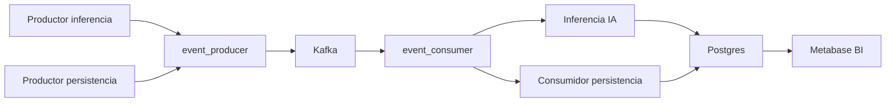
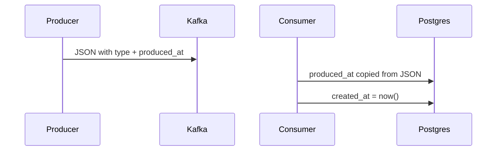

# Architecture notes (referential evidence)

Session notes for hitos 4–6: what was built, how it maps to the mentor’s diagram, how scaling works, and the proposed Compose split.

---

## Mentor architecture (target)



Two producers share one Kafka producer client. One consumer client polls the topic, then **forks**: persist trips vs infer a price. Both paths write Postgres. Metabase is the dashboard.

“IA” is currently `recommended_price = distance_km * 2.5`. A real model can replace that function later without changing Kafka or Compose.

---

## Current repo vs mentor boxes

| Mentor box | Today | After splitting `main.py` |
|---|---|---|
| Productor persistencia | Compose `producer` → `python main.py -p -r` | `src/producers/persist.py` |
| Productor inferencia | Compose `producer-inference` → `python main.py -p --inference` | `src/producers/inference.py` |
| event_producer | `src/event_producer.py` | keep (shared) |
| Kafka | Compose `kafka` (INTERNAL `kafka:9093`) | keep |
| event_consumer | `src/event_consumer.py` | keep (shared) |
| Inferencia (IA) | `infer_event` in `main.py` | `src/handlers/infer.py` |
| Consumidor persistencia | `persist_event` in `main.py` | `src/handlers/persist.py` |
| Fork | `handle_event` in `main.py` | `src/handlers/router.py` |
| Postgres | `src/models/` (`events`, `inference_results`) | keep |
| Metabase | Compose `metabase` | keep |
| CLI | `main()` | `main.py` flags only |

Do **not** grow `src/components/` — it duplicates the Kafka clients. One `EventProducer` / `EventConsumer` at `src/`.

Compose **commands stay the same** after the Python split (`-p -r`, `-c`, `--inference`).

---

## Hitos

### Hito 4 — Dockerización (done)

- One `Dockerfile`, same image for app processes.
- Separate services: `producer`, `consumer` (later `producer-inference`).
- **No** `container_name` on those services (required for `--scale`).
- In-container addresses: Kafka `kafka:9093`, Postgres `postgres:5432`.
- Host / `dev` still use `.env` (`127.0.0.1:9092`, `localhost`).
- Kafka `KAFKA_NUM_PARTITIONS: 3` so extra consumers get partitions.

Scale is **not** Python. Compose starts N replicas of a service:

```bash
docker compose up -d --scale producer=2 --scale consumer=3 --scale producer-inference=1
```

Consumers share `KAFKA_GROUP_ID`. Replicas ≤ partitions or extras sit idle. Producers scale without extra Kafka setup.

### Hito 5 — Inferencia y comandos (code done; dashboard is the last checkbox)

- Same topic `user-events`.
- JSON field `type`: `persist` | `inference`.
- `produced_at` in the message (event time; survives DB rebuild).
- `created_at` = Postgres insert time (resets on `down -v`).
- Consumer fork: persist → `events`; inference → `inference_results`.
- Inference keys: `infer-*`. Persist keys: `event-*`.
- Metabase: host `postgres`, db `testdb`, user `admin`, password `admin123`. Chart `inference_results.recommended_price` vs `produced_at`. Dashboard “Precios recomendados”.

### Hito 6 — Testing (not started)

- `pytest` is already a dev dependency.
- Test persist handler and inference handler.
- Fake Kafka messages; mock DB. No broker in tests.
- Easier after handlers live outside `main.py`.

---

## Events and clocks



Old messages without `produced_at` fall back to Kafka’s broker timestamp.

---

## Ports and commands

| Service | URL / port |
|---|---|
| Kafka UI | http://localhost:8080 |
| Metabase | http://localhost:3000 |
| Kafka (host clients) | `127.0.0.1:9092` |
| Postgres (host clients) | `localhost:5432` |

```bash
# full stack
docker compose up -d --build

# logs
docker compose logs -f producer consumer producer-inference

# stop, keep data
docker compose down

# wipe Kafka + Postgres volumes
docker compose down -v
```

`up producer consumer` does **not** start kafka-ui or metabase.

Do not run host `python main.py -r` while producer containers are up (double produce).

---

## Two Compose files (mentor suggestion)

**Yes — do this.** One file was the right start. Two files match the same split as the Python modules: **infra you reuse** vs **your processes you rebuild and scale**.

| File | Services |
|---|---|
| Infra | `kafka`, `kafka-ui`, `postgres`, `metabase`, `dev` |
| App | `producer`, `consumer`, `producer-inference` |

Why it helps:

- Rebuild/scale producers and consumers without restarting Kafka/Postgres.
- Matches the mentor diagram (shared platform vs your modules).
- `down` on the app file does not wipe infra volumes if you only stop app services.

How to wire it (same project, same network):

```bash
docker compose -f docker-compose.infra.yml -f docker-compose.app.yml up -d --build
docker compose -f docker-compose.infra.yml -f docker-compose.app.yml up -d --scale consumer=3
docker compose -f docker-compose.infra.yml -f docker-compose.app.yml logs -f consumer
```

Or `export COMPOSE_FILE=docker-compose.infra.yml:docker-compose.app.yml` and keep using `docker compose up`.

Rules:

- Keep the **same project name** (default: folder name `kafka`) so DNS names `kafka` and `postgres` still resolve.
- App services still `depends_on: kafka` / `postgres`.
- App still overrides `KAFKA_BOOTSTRAP_SERVERS=kafka:9093` and `POSTGRES_HOST=postgres`.
- Still no `container_name` on app services.
- `.devcontainer` can keep pointing at the infra file (plus override); `dev` stays infra.

Optional later: Compose `include:` from the app file. `-f` two files is enough for the assignment.

Not required: a second Docker network. Merged Compose files share the default network.

---

## Lessons already paid for

- YAML: keys under `producer:` / `consumer:` must be indented (otherwise duplicate `build`).
- `build: .` needs a real `Dockerfile` in the repo root.
- `InferenceResult` is defined in `src/models/event.py`; `main.py` must import it.
- `create_all` does not `ALTER` existing tables; new columns need `down -v` or SQL.
- Persist producer volume can hide inference in Kafka UI; filter keys `infer-`.
- Postgres in Docker is UTC; Metabase in UTC+10 can make `created_at` look like “yesterday”.

---

## Suggested next steps

1. Split `main.py` into producers / handlers as in the table above.
2. Split Compose into infra + app files.
3. Hito 6: pytest on `persist_event` and `infer_event`.
4. Kubernetes only if required: same replica idea as `--scale`.
