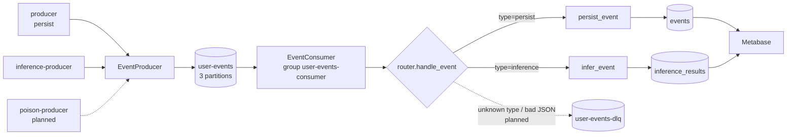
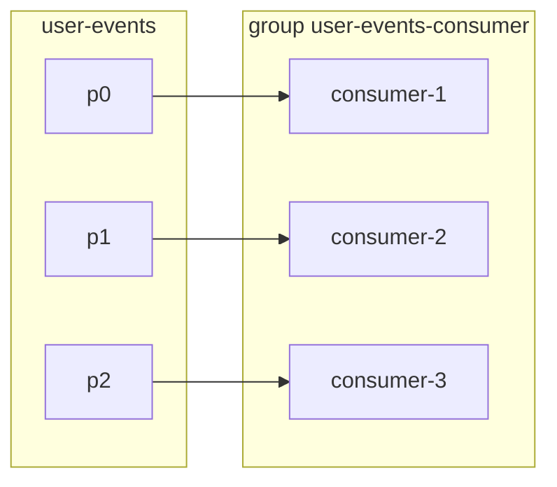
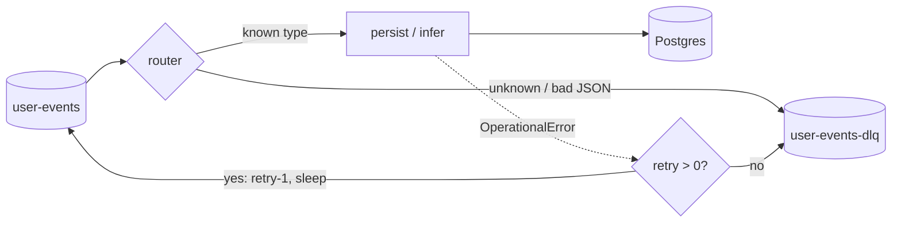

# Architecture notes

Study notes for the Kafka course project: what is built, why, and how to run it.
Source of truth is the code; update this file when the code changes.

---

## 1. Big picture


```mermaid
flowchart LR
  PP[producer<br/>persist] --> EP[EventProducer]
  PI[inference-producer] --> EP
  PZ[poison-producer<br/>planned] -.-> EP
  EP --> T[(user-events<br/>3 partitions)]
  T --> EC[EventConsumer<br/>group user-events-consumer]
  EC --> R{router.handle_event}
  R -- type=persist --> P[persist_event] --> E[(events)]
  R -- type=inference --> I[infer_event] --> IR[(inference_results)]
  R -. unknown type / bad JSON<br/>planned .-> DLQ[(user-events-dlq)]
  E --> MB[Metabase]
  IR --> MB
```

- Producers and consumer are the **same Docker image**, different commands.
- One shared producer client and one shared consumer client; the router forks by the JSON field `type`.
- "IA" is `recommended_price = distance_km * 2.5`. A real model can replace that function without touching Kafka or Compose.

---

## 2. Code layout

| Path | Role |
|---|---|
| `main.py` | CLI only: `-p -r` (persist), `-p --inference`, `-c` (consume) |
| `src/event_producer.py` | `EventProducer.publish(key, value)` – shared Kafka producer |
| `src/event_consumer.py` | `EventConsumer.consume(handler, limit)` – shared Kafka consumer |
| `src/clock.py` | `utc_now`, `event_time`, `sleep_with_variation` |
| `src/producers/persist.py` | Trip events, `type: persist`, keys `event-N`, sometimes replays a key |
| `src/producers/inference.py` | Quote requests, `type: inference`, keys `infer-N` |
| `src/consumers/router.py` | `handle_event` (fork), `consume_events` (loop) |
| `src/consumers/persist.py` | `persist_event` → table `events` |
| `src/consumers/infer.py` | `infer_event` → table `inference_results` |
| `src/models/` | `Event`, `InferenceResult`, `get_session`, `create_tables` |
| `src/components/` | Old duplicate of the clients. Do not use or grow. |
| `tests/` | pytest against real Kafka + Postgres (see §7) |

---

## 3. Docker Compose

`docker-compose.yml` only `include:`s the two files, so plain `docker compose ...` sees all services.

| File | Services |
|---|---|
| `docker-compose.infra.yml` | `kafka`, `kafka-ui`, `postgres`, `metabase`, `dev` |
| `docker-compose.app.yml` | `producer`, `inference-producer`, `consumer` (planned: `poison-producer`) |

Rules:

- App services have **no `container_name`** so they can run several replicas.
- Replicas come from `.env` via `deploy.replicas`. `--scale` overrides it for one run.
- Consumer replicas ≤ partitions (3), otherwise extras are idle.
- In containers: `KAFKA_BOOTSTRAP_SERVERS=kafka:9093`, `POSTGRES_HOST=postgres`.
- On the Mac and in tests: `127.0.0.1:9092`, `localhost`.
- Postgres has no `container_name`, so its name is `kafka-postgres-1`. Prefer `docker compose stop postgres`.

```bash
docker compose up -d --build                          # everything
docker compose -f docker-compose.infra.yml up -d      # infra only (tests)
docker compose logs -f producer inference-producer consumer
docker compose down                                   # stop, keep data
docker compose down -v                                # also wipe Kafka + Postgres volumes
```

| Service | Address |
|---|---|
| Kafka UI | http://localhost:8080 |
| Metabase | http://localhost:3000 (host `postgres`, db `testdb`, user `admin`) |
| Kafka from Mac | `127.0.0.1:9092` |
| Postgres from Mac | `localhost:5432` |

---

## 4. Environment variables

`.env` and `.env.test` are **git-ignored**: they are not versioned and are the same on every branch.
This table is the record of what they must contain.

| Variable | `.env` | `.env.test` | Used by |
|---|---|---|---|
| `KAFKA_BOOTSTRAP_SERVERS` | `127.0.0.1:9092` | same | all clients (Compose overrides to `kafka:9093`) |
| `KAFKA_TOPIC` | `user-events` | `test-user-events` | producers, consumer |
| `KAFKA_GROUP_ID` | `user-events-consumer` | `test-events-consumer` | consumer |
| `POSTGRES_HOST` / `PORT` / `USER` / `DB` | `localhost` / `5432` / `admin` / `testdb` | same | models |
| `PERSIST_PRODUCER_REPLICAS` | `2` | – | Compose |
| `INFERENCE_PRODUCER_REPLICAS` | `1` | – | Compose |
| `CONSUMER_REPLICAS` | `3` | – | Compose |
| `PRODUCER_INTERVAL` | `2.0` | – | producers |
| `PRODUCER_INTERVAL_VARIATION` | `0.5` | – | persist producer (see §9) |
| *planned* `POISON_PRODUCER_INTERVAL` | `5` | – | poison producer |
| *planned* `POISON_PRODUCER_REPLICAS` | `1` | – | Compose |
| *planned* `KAFKA_DLQ_TOPIC` | `user-events-dlq` | `test-user-events-dlq` | router |
| *planned* `RETRY_DELAY_SECONDS` | `2` | – | router |
| *planned* `EVENT_RETRIES` | `5` | – | producers, router |

---

## 5. Kafka concepts in this project

| Concept | What it is | Here |
|---|---|---|
| Broker | A Kafka server: stores and serves messages | container `kafka`, node 1 |
| Controller (KRaft) | Keeps cluster metadata; no ZooKeeper | same process (`broker,controller`) |
| Cluster | Brokers working together | 1 broker, replication factor 1 (no redundancy) |
| Listener | Network entry point | `HOST` 9092 (Mac), `INTERNAL` 9093 (containers), `CONTROLLER` 9094 |
| Topic | Named stream of messages | `user-events`, `test-user-events`, planned `user-events-dlq` |
| Partition | Ordered append-only log; unit of parallelism | 3 per topic (tests create 1) |
| Offset | Position of a message in one partition | 0, 1, 2… never changes; reading does not delete |
| Key | Decides the partition: `hash(key) % partitions` | `event-N`, `infer-N`, planned `poison-N` |
| Value | Message body (bytes) | JSON with `type`, `produced_at` |
| Consumer group | Consumers sharing `group.id`; partitions are split among them | `user-events-consumer` |
| Rebalance | Reassigning partitions when members join/leave | on scale, restart, crash |
| Committed offset | "Group finished everything before here" | stored in `__consumer_offsets` |
| Lag | log-end offset − committed offset | `kafka-consumer-groups.sh --describe` |
| Retention | When old messages are deleted | default 7 days, not on read |
| DLQ | Just another topic for events we cannot process | planned `user-events-dlq` |

Key facts:

- Ordering is guaranteed **only within a partition**. Same key → same partition → ordered.
- Kafka does **not** deduplicate. Replays and retries are absorbed by `on_conflict_do_nothing`.
- `auto.offset.reset=earliest` only applies when the group has **no** committed offset.
- Auto-commit: the offset is marked when `poll()` returns the message and committed every ~5 s.
  If the handler crashes after that, the message can be **lost**. Re-publishing before moving on gives **at-least-once**.


```mermaid
flowchart LR
  subgraph T[user-events]
    P0[p0]
    P1[p1]
    P2[p2]
  end
  subgraph G[group user-events-consumer]
    C1[consumer-1]
    C2[consumer-2]
    C3[consumer-3]
  end
  P0 --> C1
  P1 --> C2
  P2 --> C3
```

Inspection commands (`kt() { docker exec -it kafka /opt/kafka/bin/"$@"; }`):

```bash
kt kafka-topics.sh --bootstrap-server kafka:9093 --list
kt kafka-topics.sh --bootstrap-server kafka:9093 --describe --topic user-events
kt kafka-consumer-groups.sh --bootstrap-server kafka:9093 --describe --group user-events-consumer
kt kafka-console-consumer.sh --bootstrap-server kafka:9093 --topic user-events --from-beginning \
  --max-messages 20 --property print.key=true --property print.partition=true --property print.offset=true
```

---

## 6. Events and clocks

```json
{"type": "persist", "produced_at": "2026-10-01T12:00:00+00:00",
 "vehicle-id": "vehicle-4", "driver-id": "driver-4", "user-id": "user-4",
 "duration": "12 minutes", "distance": "8.3 km", "amount": "$20.75"}
```

```json
{"type": "inference", "produced_at": "2026-10-01T12:00:00+00:00",
 "user-id": "user-1", "duration": "12 minutes", "distance": "8.3 km"}
```

- `produced_at`: event time, written by the producer, copied to Postgres. Survives a DB rebuild.
- `created_at`: Postgres insert time (`now()`). Resets on `down -v`.
- Old messages without `produced_at` fall back to the Kafka message timestamp (`event_time`).
- Postgres runs in UTC; Metabase in UTC+10 can make times look like "yesterday".

---

## 7. Tests

- `tests/conftest.py` loads `.env`, then `.env.test` (topic `test-user-events`, group `test-events-consumer`).
- Fixture `topic`: deletes and recreates the test topic (1 partition) around each test.
- Fixture `db`: `create_tables()`.
- Real Kafka + Postgres: start **only infra**, keep app containers down (they would consume test data).
- File names must be unique across folders (no two `test_persist.py`).

```bash
docker compose -f docker-compose.infra.yml up -d
uv run pytest -v
```

| File | Covers |
|---|---|
| `tests/components/test_event_producer.py` | publish → consume round trip |
| `tests/components/test_event_consumer.py` | consume a message; stop on timeout |
| `tests/producers/test_trip_producer.py` | persist event shape |
| `tests/producers/test_inference.py` | inference event shape |
| `tests/consumers/test_trip_consumer.py` | `persist_event` writes / skips bad JSON |
| `tests/consumers/test_infer.py` | `handle_event` → `inference_results` |

---

## 8. Robustness week: DLQ and retries (branch `feature/robustness-dlq-retries`)

Concepts:

- **Robust**: survives bad data and contract changes without stopping.
- **Poison event**: can never be processed (unknown format/type). Do not retry → DLQ.
- **DLQ**: topic that stores failed events for later analysis.
- **Retry policy**: re-process events that failed for temporary reasons (network blip, DB down).
- **Self-recovery**: the system returns to normal on its own (`restart: unless-stopped` + retries).

| Failure | Example | Retry? | Destination |
|---|---|---|---|
| Contract change | `type: "refund"` | no | DLQ |
| Corrupt data | invalid JSON | no | DLQ |
| Temporary outage | Postgres down → `sqlalchemy.exc.OperationalError` | yes | same topic, then DLQ when `retry` hits 0 |


```mermaid
flowchart LR
  T[(user-events)] --> R{router}
  R -- known type --> H[persist / infer] --> PG[(Postgres)]
  R -- unknown / bad JSON --> DLQ[(user-events-dlq)]
  H -. OperationalError .-> Q{retry > 0?}
  Q -- yes: retry-1, sleep --> T
  Q -- no --> DLQ
```

Design decisions:

- The **consumer** decides what goes to the DLQ (only it knows what it cannot process).
- `EventProducer(topic=None)` gets an optional topic so the router can write to the DLQ and re-queue.
- DLQ message: `{"reason", "failed_at", "original"}`, same key as the original.
- Retry re-publishes with the **same key** → same partition, but behind newer messages (order changes).
- `sleep(RETRY_DELAY_SECONDS)` before re-publishing, otherwise a hot loop while Postgres is down.
- `retry` lives in the JSON payload; missing field → default `EVENT_RETRIES`.

Status:

- [ ] Hito 1 – poison producer (`type: refund`, every 5 s, `python main.py -p --poison`, service `poison-producer`)
- [ ] Hito 2 – DLQ topic `user-events-dlq`; router sends unknown type / bad JSON there
- [ ] Hito 3 – stop Postgres, identify `OperationalError`, re-queue forever, start Postgres, verify rows
- [ ] Hito 4 – `retry` field, decrement on each retry, DLQ when exhausted

Verification:

```bash
docker compose stop postgres     # watch "⟳ Retry" in consumer logs
docker compose start postgres    # watch "✓ Persisted"
docker compose exec postgres psql -U admin -d testdb -c \
  "select id, produced_at, created_at from events order by created_at desc limit 10;"
kt kafka-console-consumer.sh --bootstrap-server kafka:9093 --topic user-events-dlq \
  --from-beginning --property print.key=true
```

---

## 9. Known quirks and lessons

- `PRODUCER_INTERVAL_VARIATION` (0.5) is used both as ± seconds of jitter **and** as the replay probability in the persist producer → ~50 % replays.
- The inference producer uses `time.sleep(interval)`, no jitter.
- `create_all` does not `ALTER` existing tables; new columns need `down -v` or SQL.
- `create_tables()` runs at consumer start: if Postgres is down at boot, the consumer crash-loops until Postgres is back.
- Changing `.env` needs `docker compose up -d` (recreate), not `restart`.
- Do not run host `python main.py -p ...` while producer containers are up (double produce).
- Persist events can hide inference events in Kafka UI; filter by key `infer-`.
- YAML: keys under a service must be indented; `build: .` needs a root `Dockerfile`.

---

## 10. Hito history

| Hito | Status |
|---|---|
| Dockerization (one image, separate services, no `container_name`, 3 partitions) | done |
| Inference + commands (`type`, `produced_at`, fork, Metabase chart) | done |
| Split `main.py` into producers / consumers | done |
| Split Compose into infra + app | done |
| Testing with pytest | done |
| Robustness: DLQ + retries | in progress (§8) |
| Kubernetes (branch `k8s-exploration`) | not started |
